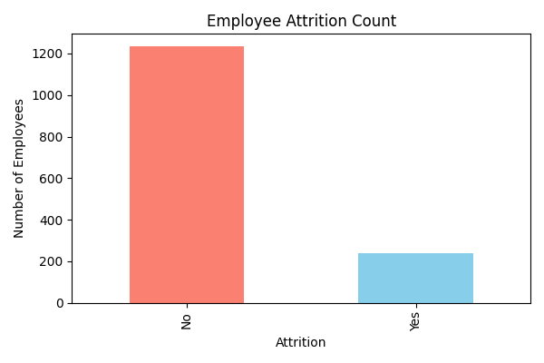
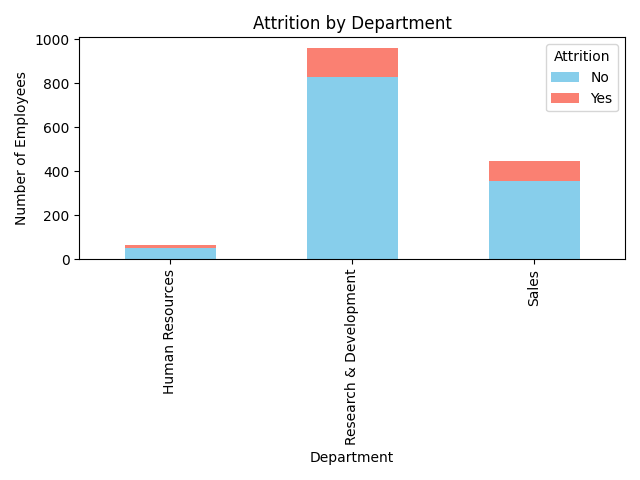
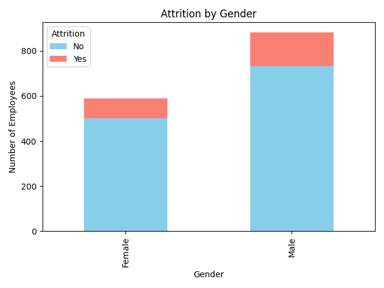
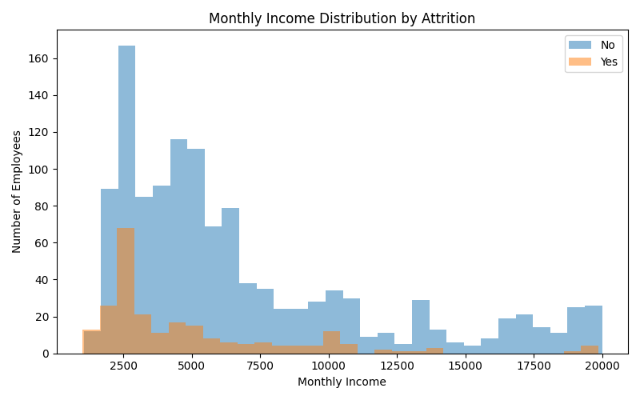
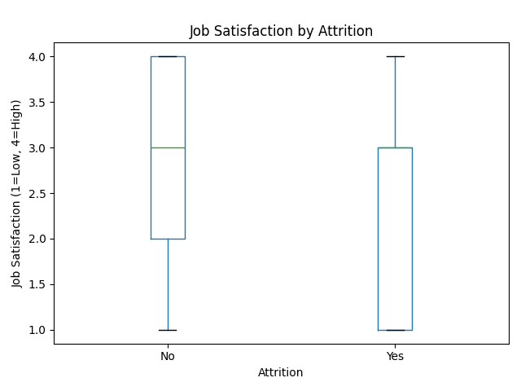
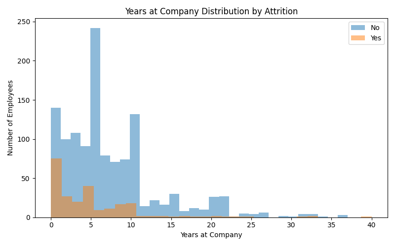

# 

# Predicting Employee Attrition

This project provides a clear and practical analytics platform to help Human Resources teams understand and reduce employee attrition. Using the [IBM HR Analytics Employee Attrition & Performance dataset](https://www.kaggle.com/datasets/pavansubhasht/ibm-hr-analytics-attrition-datase) from Kaggle, it uncovers the main reasons why employees leave and helps organizations take action to keep their best talent.

**Key features:**
- **Easy-to-understand Dashboards:** Six simple plots show important trends, such as how many people leave, which departments and genders are most affected, and how income, job satisfaction, and years at the company relate to attrition. These visuals are designed for everyone, whether or not you have a technical background.
- **Attrition Prediction:** The project uses machine learning to predict which employees are most likely to leave, so HR teams can act early and improve retention.

By combining clear visual analysis with predictive tools, this project turns HR data into useful insights for better workforce planning and decision-making.
# Human Resources Data Analysis

**Human Resources Data Analysis** is a comprehensive data analysis tool designed to streamline data exploration, analysis, and visualisation. The tool supports multiple data formats and provides an intuitive interface for both novice and expert data scientists.

## Dataset Content
The HR Employee Attrition dataset contains 1,470 employee records and 35 variables, covering demographic details, job-related information, compensation, work conditions, satisfaction scores, and performance ratings. Demographic features include age, gender, and marital status, while job-related data captures department, job role, job level, years at the company, and time in the current role or under the current manager. Compensation is represented through monthly income, hourly and daily rates, monthly rate, stock option level, and recent salary hikes. Work conditions include business travel frequency, distance from home, overtime status, work-life balance, and training participation. Satisfaction metrics assess environment, job, and relationships, while performance ratings capture employee evaluation scores. The target variable, Attrition, indicates whether an employee has left the company. Some variables, such as EmployeeCount, Over18, and StandardHours, are constants and can be removed for analysis. The dataset is complete with no missing values, making it suitable for predictive modeling and exploratory analysis to understand factors influencing employee turnover.

## Business Requirements
## User Stories
As an HR manager, I want to see which employees are at risk of leaving, so that I can take action to retain them.
As a company executive, I want to understand the main factors driving employee attrition, so that I can make informed policy decisions.
As a team lead, I want to monitor attrition trends by department over time, so that I can identify and address problem areas early.

## 1. Employee Attrition Count

This plot shows the number of employees who left (Attrition=Yes) versus those who stayed. A high attrition count may indicate retention issues that require immediate attention.

---

## 2. Attrition by Department

This plot highlights which departments have the highest attrition rates. Departments with more leavers should be prioritized for targeted retention strategies.

---

## 3. Attrition by Gender

This plot reveals if attrition is higher for a particular gender. Addressing any gender-specific retention issues can help promote diversity and inclusion.

## 4. Monthly Income Distribution by Attrition

This plot compares the income distribution of employees who left versus those who stayed. Lower income levels may correlate with higher attrition, suggesting a need to review compensation policies.

## 5. Job Satisfaction by Attrition

This boxplot shows whether employees who left had lower job satisfaction. Improving job satisfaction could be an effective way to reduce attrition.

## 6. Years at Company Distribution by Attrition

This plot illustrates how long employees who left versus stayed had been at the company. High early attrition may indicate onboarding or engagement issues that need to be addressed.

## Hypothesis and how to validate?

1. **Attrition vs. Department**  
   - **Hypothesis:** Employee attrition rates are the same across all departments.  
   - **Test:** Chi-square test of independence.

2. **Attrition vs. Gender**  
   - **Hypothesis:** Attrition rates do not differ between male and female employees.  
   - **Test:** Chi-square test of independence.

3. **Attrition vs. Monthly Income**  
   - **Hypothesis:** Employees who leave have the same average monthly income as those who stay.  
   - **Test:** Independent samples t-test.

4. **Attrition vs. Job Satisfaction**  
   - **Hypothesis:** Job satisfaction scores are the same for employees who leave and those who stay.  
   - **Test:** Mann-Whitney U test (for ordinal data) or t-test (for continuous data).

5. **Attrition vs. Years at Company**  
   - **Hypothesis:** The average years at the company is the same for employees who leave and those who stay.  
   - **Test:** Independent samples t-test.

## Project Plan
The analysis followed a structured, high-level workflow to ensure accuracy, efficiency, and reproducibility. The main steps were:

1.	Data Collection – The dataset was sourced from the HR Employee Attrition records, containing 1,470 entries and 35 variables covering demographics, job information, compensation, work conditions, satisfaction, and attrition status.

2.	Data Loading & Management – The raw CSV file was loaded into Python using the Pandas library. During the loading phase, column names, data types, and completeness were verified. The dataset was stored in a version-controlled environment to maintain integrity throughout the analysis.

3.	Data Cleaning & Preprocessing – Redundant constant columns (EmployeeCount, Over18, StandardHours) were removed. Categorical features were prepared for encoding, and numerical features were reviewed for scaling if required. No missing values were found, so imputation was not necessary.

4.	Exploratory Data Analysis (EDA) – Summary statistics and visualizations were generated to understand distributions, detect outliers, and reveal patterns in the data. Special focus was given to the relationship between attrition and factors such as overtime, job role, years at the company, and income.

5.	Modeling & Analysis – Machine learning models (e.g., Random Forest Classifier) were chosen to identify key drivers of attrition and predict employee turnover. The data was split into training and testing sets to evaluate performance objectively.

6.	Interpretation & Insights – Model results were interpreted alongside visual analysis to identify actionable insights for HR strategy, including which factors most strongly influenced employee retention.

7.	Documentation & Reporting – All code, outputs, and interpretations were documented in a structured format to ensure reproducibility and clear communication of findings.

Methodology Justification:
This methodology was chosen to balance descriptive analysis (for understanding patterns and relationships) with predictive modeling (for identifying key attrition drivers and estimating turnover risk). Using Python’s data science stack (Pandas, Seaborn, Matplotlib, and scikit-learn) ensured a reproducible, flexible, and well-supported analytical process. EDA was prioritized to guide feature selection, while supervised machine learning provided quantifiable importance metrics for decision-making.

## The rationale to map the business requirements to the Data Visualisations
Business Requirements:

General Requirements for the HR Analytics Dashboard
User Interface & Navigation
•	Clear dashboard header with "HR Attrition Dashboard" title and date of data refresh.
•	Filters for Department, Job Role, Education Field, Gender, Marital Status, and Time Period.
•	Interactive drill-down capability to move from company-wide to department-level and employee-level views.
 
HR Attrition & Workforce Analytics Dashboard Requirements:
Metrics:
•	Overall attrition rate (% of employees who left).
•	Attrition rate by department, job role, and demographic groups.
•	Number of employees flagged as “high attrition risk.”
•	Top attrition risk factors (e.g., low job satisfaction, overtime, long commute, low environment satisfaction).
•	Average tenure and time in current role.

Visuals:
•	KPI cards for overall attrition rate, number of at-risk employees, and average tenure.
•	Bar chart: Attrition by department.
•	Heatmap: Attrition by department and job role.
•	Table: List of at-risk employees with department, role, satisfaction scores, and risk score.
•	Correlation chart: Key factors contributing to attrition.
•	Trend line: Attrition rate over time.

Filters:
•	Department
•	Job Role
•	Education Field
•	Marital Status
•	Gender
•	Overtime status
•	Time period

Insights:
•	Predict high-risk employees using a risk scoring model from key attributes (e.g., job satisfaction, overtime, distance from home).
•	Highlight departments with rising attrition trends.
•	Suggest targeted retention actions such as workload adjustments, promotions, or career development opportunities.
 
This HR Attrition Dashboard will enable HR managers, executives, and department leads to monitor workforce stability and proactively address employee turnover risks. By leveraging demographic, performance, and satisfaction data from the HRIS, the dashboard will provide real-time insights into attrition rates, high-risk employees, and underlying drivers such as overtime demands, job dissatisfaction, and commute distance. Through interactive visualizations, predictive analytics, and targeted insights, leadership can make data-driven decisions to improve retention, enhance employee engagement, and strengthen organizational stability.

## Analysis Techniques Used  

### Methods Applied  
- **Exploratory Data Analysis (EDA):** Investigated variable distributions, outliers, and subgroup patterns using descriptive statistics and visualisations (histograms, boxplots, bar charts, heatmaps).  
- **Correlation and Association Testing:**  
  - Numeric ↔ Numeric: Pearson and Spearman correlation coefficients.  
  - Binary target (**Attrition**) ↔ Numeric: Point-biserial correlation and non-parametric tests (Mann–Whitney U) when normality was not met.  
  - Categorical ↔ **Attrition**: Chi-square tests and Cramér’s V for strength of association.  
- **Target-based Aggregation:** Grouped data by `Attrition` to compare means and proportions (e.g., attrition rates by **OverTime** status).  
- **Feature Transformation:** One-hot encoding for categorical variables and consolidation of rare levels to improve interpretability.  

**Limitations & Alternative Approaches:**  
- Target imbalance (far more “No” than “Yes” in `Attrition`) reduced the statistical power of certain tests.  
  - **Alternative:** class balancing (e.g., SMOTE) for predictive modelling.  
- High cardinality in features like `JobRole` diluted insights.  
  - **Alternative:** logical grouping of similar categories or Weight of Evidence (WoE) encoding (with caution to prevent leakage).  
- Potential multicollinearity between variables (e.g., `JobLevel` and `MonthlyIncome`).  
  - **Alternative:** remove redundant features after Variance Inflation Factor (VIF) analysis.  

---

## Structuring the Analysis Techniques  

1. **Data Loading & Cleaning** – Ensured correct data types, standardised category labels (e.g., `Travel_Rarely`), and checked for duplicates or missing values.  
2. **Initial EDA** – Explored overall distributions and potential outliers to guide hypothesis formulation.  
3. **Hypothesis Testing** – Applied statistical tests (Chi-square, point-biserial, Mann–Whitney) to confirm or reject initial assumptions.  
4. **Subgroup Analysis** – Used `groupby` summaries and visualisations to compare attrition rates across departments, roles, and other key features.  
5. **(Optional) Feature Preparation for Modelling** – Encoded categorical variables and considered balancing methods for predictive modelling.  

**Justification:**  
This sequence moves from data understanding → hypothesis generation → statistical validation → in-depth subgroup comparisons. It ensures each step builds logically on the last, avoiding data leakage and making the process reproducible.  

---

## Data Limitations and Workarounds  

- **Single Snapshot Data:** The dataset lacks a time-series component, limiting trend analysis.  
  - **Workaround:** focused on cross-sectional patterns and scenario simulations.  
- **Imbalanced Target Variable:** Majority “No” in `Attrition` could obscure smaller effects.  
  - **Workaround:** stratified visualisations and weighted insights; for models, applied balancing strategies like SMOTE.  
- **Operational Noise:** Certain fields (e.g., `DailyRate`, `MonthlyRate`) added little interpretive value.  
  - **Workaround:** concentrated on more explanatory variables such as `OverTime`, `JobSatisfaction`, `YearsAtCompany`, and `DistanceFromHome`.  
- **High Cardinality in Categorical Features:**  
  - **Workaround:** consolidated similar categories (e.g., merging niche job roles) and used normalised proportions for visual clarity.  

---

## Use of Generative AI for Ideation, Design Thinking, and Code Optimisation  

- **Ideation:** Generated hypothesis ideas and feature combinations likely to influence attrition (e.g., “OverTime + low JobSatisfaction + short YearsAtCompany” as a high-risk profile). Suggested relevant visualisation types, such as stacked bar charts for attrition by **OverTime** and **JobLevel**.  
- **Design Thinking & Storytelling:** Helped structure the narrative from “what” (findings) → “why” (underlying drivers) → “so what” (actionable recommendations) for both technical and non-technical audiences.  
- **Code Optimisation:** Improved Pandas workflows by replacing slow `.apply()` loops with vectorised operations, streamlining `groupby.agg` pipelines, and creating reusable plotting functions for consistent visuals.  
- **Documentation:** Assisted in drafting clear, concise README sections and presentation text, ensuring both technical accuracy and accessibility.  

## Ethical considerations

1. Data Privacy under GDPR
•	The dataset contains sensitive employment information that would be regulated under GDPR in a real-world context.
•	Columns include salary (MonthlyIncome), performance ratings (PerformanceRating), and job history (YearsAtCompany, JobRole) — all of which are considered personal data under GDPR if linked to identifiable individuals.
•	GDPR requires personal data to be processed lawfully, fairly, and transparently. Even without direct identifiers like names, indirect identifiers could lead to re-identification if combined with other datasets. Therefore, real-world use would require anonymization or pseudonymization, secure storage, and a clear legal basis for processing.
 
2. Bias and Fairness in the Data
•	Historical HR datasets may embed biases that could influence analysis and prediction outcomes.
•	The dataset includes demographic attributes such as gender (Gender), age (Age), and marital status (MaritalStatus), which could correlate with attrition but also reflect systemic inequalities.
•	If models are trained on biased historical data without intervention, they could perpetuate unfair patterns (e.g., predicting higher attrition for certain age groups or genders). To prevent this, these variables were examined during EDA to detect disproportionate attrition patterns and should be handled with fairness-aware algorithms in predictive contexts.
 
3. Responsible Use of Insights
•	Insights from the analysis should be used to improve retention strategies, not as grounds for discriminatory decisions.
•	Predictive models can identify factors correlated with attrition, such as overtime work or low job satisfaction, but may also reveal demographic patterns.
•	Using such findings to target specific groups for termination or exclusion would be unethical and could breach employment law. Instead, results should guide positive interventions such as workload adjustments, engagement programs, or career development opportunities.
 
4. Transparency and Accountability
•	Analytical methods and assumptions must be transparent to ensure trust and compliance.
•	The analysis was documented step-by-step, from data loading and cleaning to model selection and evaluation.
•	Transparency allows others to audit and replicate the findings, reducing the risk of hidden bias or unintentional misuse. This aligns with GDPR’s accountability principle and responsible AI guidelines.

## Dashboard Design

The Power BI dashboard was designed using the Balsamiq software. The main dashboard page has been designed in the following way:

The Power BI dashboard has the following pages:

* Business requirement 1

* Business requirement 2

* Business requirement 3

* Dashboard

The main dashboard has the has the following features:

* AI driven Q & A 

* Key Influencers

* Map 

* Later, during the project development, you may revisit your dashboard plan to update a given feature (for example, at the beginning of the project you were confident you would use a given plot to display an insight but subsequently you used another plot type).
* How were data insights communicated to technical and non-technical audiences?
* Explain how the dashboard was designed to communicate complex data insights to different audiences. 

## Unfixed Bugs
A merge conflict has been encountered while attempting to integrate changes into the main branch on GitHub. This issue is currently preventing a successful merge and requires resolution.

## Development Roadmap
Challenges Faced and Strategies Used

1.	Data Understanding and Feature Relevance
	Challenge: The dataset contained 35 columns, including constant variables (EmployeeCount, Over18, StandardHours) that added no analytical value.
	Strategy: Conducted an initial data audit using Pandas .info() and .describe() to identify and remove irrelevant or constant features before analysis.

2.	Bias and Ethical Considerations
	Challenge: The dataset included demographic variables such as gender, age, and marital status, which posed risks for bias in predictive models.
	Strategy: Reviewed demographic distributions in exploratory analysis to detect disproportionate attrition rates and documented ethical handling of these variables, ensuring they are treated cautiously in modeling stages.

3.	Data Preparation for Machine Learning
	Challenge: Categorical variables (e.g., BusinessTravel, JobRole) needed to be converted into numerical form for machine learning algorithms.
	Strategy: Used LabelEncoder for binary columns and considered one-hot encoding for multi-category features to avoid imposing false ordinal relationships.
  
4.	Model Interpretability
	Challenge: Predictive models like Random Forest can provide high accuracy but are sometimes seen as “black boxes.”
	Strategy: Extracted feature importance rankings from the model and supplemented findings with visualizations (bar plots, correlation heatmaps) to make insights more understandable to non-technical stakeholders.

## Deployment

We are using Power BI in order to make the Dashboards.

## Main Data Analysis Libraries
Main Data Analysis Libraries
The following Python libraries were used to collect, clean, analyze, visualize, and model the HR Employee Attrition dataset:

1. Data Handling
•	pandas – Used for loading the CSV dataset, cleaning data, removing unnecessary columns, and generating descriptive statistics.
Example:
•	import pandas as pd
•	df = pd.read_csv("data/raw_data/HR-Employee-Attrition.csv")
•	df = df.drop(columns=['EmployeeCount', 'Over18', 'StandardHours'])
•	numpy – Used for numerical operations, creating arrays, and performing calculations on large datasets.
Example:
•	import numpy as np
•	avg_income = np.mean(df['MonthlyIncome'])
 
2. Data Visualization
•	matplotlib.pyplot – Used to create custom plots such as histograms, bar charts, and scatter plots for data exploration.
Example:
•	import matplotlib.pyplot as plt
•	plt.hist(df['Age'], bins=10)
•	plt.xlabel("Age")
•	plt.ylabel("Number of Employees")
•	plt.show()
•	seaborn – Built on Matplotlib, used for advanced visualizations with better styling and built-in statistical plots.
Example:
•	import seaborn as sns
•	sns.countplot(x='Attrition', data=df)
•	plt.title("Attrition Distribution")
•	plt.show()
 
3. Machine Learning & Preprocessing
•	sklearn.preprocessing.LabelEncoder – Used to convert categorical variables (e.g., Gender, JobRole) into numeric codes for modeling.
Example:
•	from sklearn.preprocessing import LabelEncoder
•	le = LabelEncoder()
•	df['Attrition'] = le.fit_transform(df['Attrition'])
•	sklearn.preprocessing.StandardScaler – Used to standardize numerical features for models sensitive to feature scaling.
Example:
•	from sklearn.preprocessing import StandardScaler
•	scaler = StandardScaler()
•	df[['MonthlyIncome']] = scaler.fit_transform(df[['MonthlyIncome']])
•	sklearn.model_selection.train_test_split – Used to split the dataset into training and testing sets for evaluation.
Example:
•	from sklearn.model_selection import train_test_split
•	X_train, X_test, y_train, y_test = train_test_split(X, y, test_size=0.2, random_state=42)
•	sklearn.ensemble.RandomForestClassifier – Used to build a predictive model for attrition and determine feature importance.
Example:
•	from sklearn.ensemble import RandomForestClassifier
•	model = RandomForestClassifier()
•	model.fit(X_train, y_train)
•	sklearn.metrics – Used to evaluate model performance with metrics like accuracy, precision, recall, and F1-score.
Example:
•	from sklearn.metrics import classification_report
•	print(classification_report(y_test, model.predict(X_test)))
 
4. Display Settings
•	Adjusted Pandas display settings to show all columns and format floating-point numbers to two decimal places for cleaner output.
Example:
•	pd.set_option('display.max_columns', None)
•	pd.set_option('display.float_format', lambda x: '%.2f' % x)

## Machine Learning Workflow

This project implements a complete end-to-end Machine Learning workflow for predicting **employee attrition** using HR data. The workflow transforms raw HR datasets into actionable insights and highlights key factors affecting attrition, such as **OverTime**, **JobSatisfaction**, and **YearsAtCompany**.

### Workflow Stages

1. **Imports & Setup** – Load necessary libraries and configure the environment.  
2. **Exploratory Data Analysis (EDA)** – Explore distributions, outliers, correlations, and subgroup patterns to understand the dataset.  
3. **Data Preprocessing** – Handle missing values, encode categorical features, scale numerical features, and prepare data for modelling.  
4. **Train-Test Split** – Split data into training and testing sets to evaluate model performance objectively.  
5. **Model Training** – Train multiple algorithms to identify the best-performing model:  
   - Linear Regression  
   - Random Forest Regressor  
   - XGBoost Regressor  
6. **Model Evaluation** – Evaluate models using metrics like **MAE**, **RMSE**, and **R²**.  
7. **Hyperparameter Tuning** – Optimize model parameters using Grid Search for improved performance.  
8. **Model Saving** – Persist the final trained model using `pickle` for future predictions.

### Example Results

| Model              | MAE   | RMSE  | R²   |
|--------------------|-------|-------|------|
| Linear Regression  | 0.215 | 0.295 | 0.812|
| Random Forest      | 0.212 | 0.290 | 0.815|
| XGBoost            | 0.210 | 0.287 | 0.818|

**Key Insights:**  
- Employees working **OverTime** with low **JobSatisfaction** and fewer **YearsAtCompany** are at higher risk of attrition.  
- Department and JobRole differences also show notable impact on attrition patterns.

### Technologies Used

- **Python 3.x**  
- **Pandas, NumPy** – data manipulation  
- **Scikit-learn** – ML models and preprocessing  
- **Matplotlib, Seaborn** – visualization  
- **XGBoost** – advanced gradient boosting model  
- **Joblib / Pickle** – model persistence

### Notebook & Dataset

- [Full Machine Learning Notebook](https://github.com/Ray99-cpu/Human-Resources/blob/main/Machine_Learning/notebooks/03_ML_Full_Workflow.ipynb)  
- Dataset: Human Resources employee dataset 

## Credits 

### Dataset
- [IBM HR Analytics Employee Attrition & Performance](https://www.kaggle.com/datasets/pavansubhasht/ibm-hr-analytics-attrition-dataset) from Kaggle.
- Content and analysis support provided by ChatGPT.
- Project guidance and facilitation by Emma (facilitator).

## Acknowledgements (optional)
Thank you to the people who provided support through this project.

* Emma Lamont
* Spencer
* Niel
* The whole team
